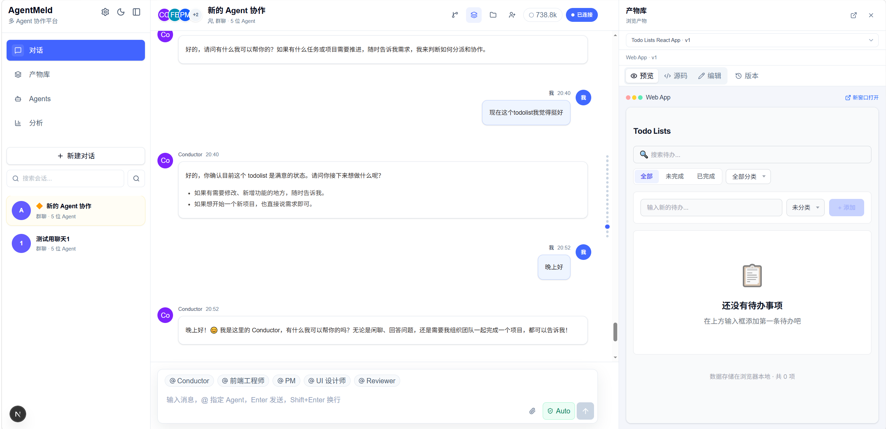

# AgentMeld

<p align="center">
  
  
  
  
  
  
  
  <a href="../LICENSE"></a>
</p>

<p align="center">
  <a href="../README.md">English</a> · <strong>简体中文</strong>
</p>

AgentMeld 是一个本地优先的多 Agent 协作工作空间。它把多 Agent 工作组织成团队群聊：Conductor 可以澄清需求、拆分复杂任务、调度不同角色的 Agent，并在对话旁统一管理工具调用、工作区文件和生成产物。



## 工作流示例

```
你："帮我做一个番茄时钟"
  → Conductor 分析需求，检查可用 Agent
  → 若需求不明确，调用 ask_user 让用户选择（或直接 plan_tasks）
  → 生成计划：t1: PM → PRD, t2: 设计师 → 风格指南, t3: 前端 → 编码, t4: Reviewer → 审查
  → 你批准计划
  → DAG 波次执行：PM 与设计师并行，前端等两者完成，Reviewer 等前端完成
  → 每个 Agent 使用工具（fs_write、bash、write_artifact），敏感操作需审批
  → 产物通过 output binding 向下游传递
  → Conductor 聚合结果，生成自然语言总结
  → 最终产物显示在右侧面板
```

> 开发者参考文档见 [skills/](../skills/)：工具系统、产物管理、上下文工程、持久化。

## 主要功能

**Agent 协作**
- 单 Agent 与多 Agent 群聊会话，IM 风格界面
- Conductor 负责计划、任务分派、DAG 调度与结果聚合
- 任务失败时自动生成 Recovery Plan，只重跑必要部分
- 每个 Agent 可独立配置 API Key、模型和 Base URL，三层优先级

**工具与安全**
- 12 个内置工具：文件读写、Shell、产物、部署、用户交互
- 敏感操作审批关卡（fs_write、bash、plan_tasks）
- Workspace 沙箱：路径校验、symlink 防护、磁盘配额
- 平台特定命令黑名单（POSIX + Windows）

**产物与工作区**
- 四种产物类型：文档、Web 应用、图片、演示文稿
- 版本链与 diff 对比
- 本地部署预览（iframe）
- 会话内文件浏览器，支持语法高亮

**上下文工程**
- Token 感知的历史窗口，模型特定预算计算
- 增量上下文压缩 + 滚动 chunk 摘要
- 置顶消息永不裁剪；超出窗口时返回明确错误
- 会话置顶与消息置顶独立管理

**可靠性**
- 445 个测试通过（Vitest），TypeScript strict 模式，ESLint
- 结构化 Logger，14 种错误分类，敏感数据脱敏
- Run 生命周期持久化，启动孤儿恢复
- 审批状态持久化到 SQLite，条件更新防并发

## 技术栈

- Next.js 16 与 React 19
- TypeScript
- Zustand 与 Immer
- SQLite、Drizzle ORM、`better-sqlite3`
- Tailwind CSS
- Vitest 与 ESLint

## 环境要求

- Node.js 20.9.0 或更高版本
- pnpm 10 或更高版本
- 至少一个模型服务 API Key，例如 DeepSeek

## 快速开始

```bash
git clone https://github.com/jackie-cqz/AgentMeld.git
cd AgentMeld
pnpm install
cp .env.example .env.local
pnpm dev
```

打开 [http://localhost:3000](http://localhost:3000)。

Windows PowerShell 使用：

```powershell
Copy-Item .env.example .env.local
```

应用启动后，也可以直接在 AgentMeld 设置面板中填写 API Key。

## 常用命令

```bash
pnpm dev        # 启动开发服务
pnpm build      # 创建生产构建
pnpm start      # 启动生产服务
pnpm typecheck  # TypeScript 检查
pnpm lint       # ESLint 检查
pnpm test       # 运行测试
pnpm db:push    # 应用 Drizzle 数据库结构
```

## 本地数据

AgentMeld 默认将数据库、工作区、预览和部署文件保存在：

```text
.agentmeld-data/
```

首次启动时，AgentMeld 会自动创建 `.agentmeld-data/agentmeld.db`，初始化所需数据表，并写入内置 Agent。普通用户无需提前创建数据库，也不需要在启动前运行 `pnpm db:push`。

该目录已被 Git 忽略。可使用 `AGENTMELD_DATA_DIR` 修改数据目录，或使用 `AGENTMELD_DB_PATH` 单独指定数据库文件。

请勿提交 `.env.local`、API Key、本地数据库、生成的 workspace 或部署产物。

## 项目结构

```text
src/
  app/          Next.js 页面与 API 路由
  components/   对话、Agent、产物、审批和工作区界面
  db/           SQLite Schema、初始化数据与持久化辅助代码
  server/       Agent 运行时、工具、Adapter、编排与服务层
  shared/       共享类型、常量和工具函数
  stores/       Zustand 状态与流式事件 Reducer
```

## 模型服务说明

AgentMeld 可以通过 OpenAI-compatible 自定义 Adapter 使用 DeepSeek。项目中也包含 Claude 和 Codex Adapter 代码，但对应集成需要各自的 SDK 凭证和兼容运行环境。

系统默认把模型输出和生成命令视为不可信输入。工作区文件访问受沙箱约束，敏感文件写入和命令执行可以要求用户审批。

## 已知限制

- 当前推荐使用 DeepSeek 或其他 OpenAI-compatible 模型服务。
- Claude Code 与 Codex Adapter 已包含基础代码，但完整 SDK 执行链路尚未完成。
- 当前部署能力生成的是本地静态预览，AgentMeld 不负责发布到托管云平台。
- AgentMeld 面向本地单用户环境，暂不提供多用户登录、鉴权和权限隔离。
- 工具调用的稳定性仍会受到模型行为影响，尤其是生成较大的结构化参数时。
- 项目仍处于活跃开发阶段，数据结构和内部 API 可能继续调整。

## 后续改进

- 完成并加固 Claude Code 与 Codex SDK Adapter。
- 改进结构化工具参数的校验、修复、重试和失败诊断。
- 加强 Conductor 的计划拆分、任务证据校验、失败重试与结果聚合。
- 提升上下文工程、压缩质量和长会话运行稳定性。
- 完善产物编辑、部署预览、版本对比和故障恢复流程。
- 支持外部 MCP 工具配置，并提供清晰的权限和审批控制。
- 持续优化前端无障碍、响应式布局、暗色模式和交互细节。
- 增加发布自动化、贡献指南和更完整的集成测试。

## 当前状态

AgentMeld 目前仍处于活跃的早期开发阶段，API、数据结构和界面细节可能在后续版本中调整。

## 开源许可证

AgentMeld 使用 [MIT License](../LICENSE) 开源。
